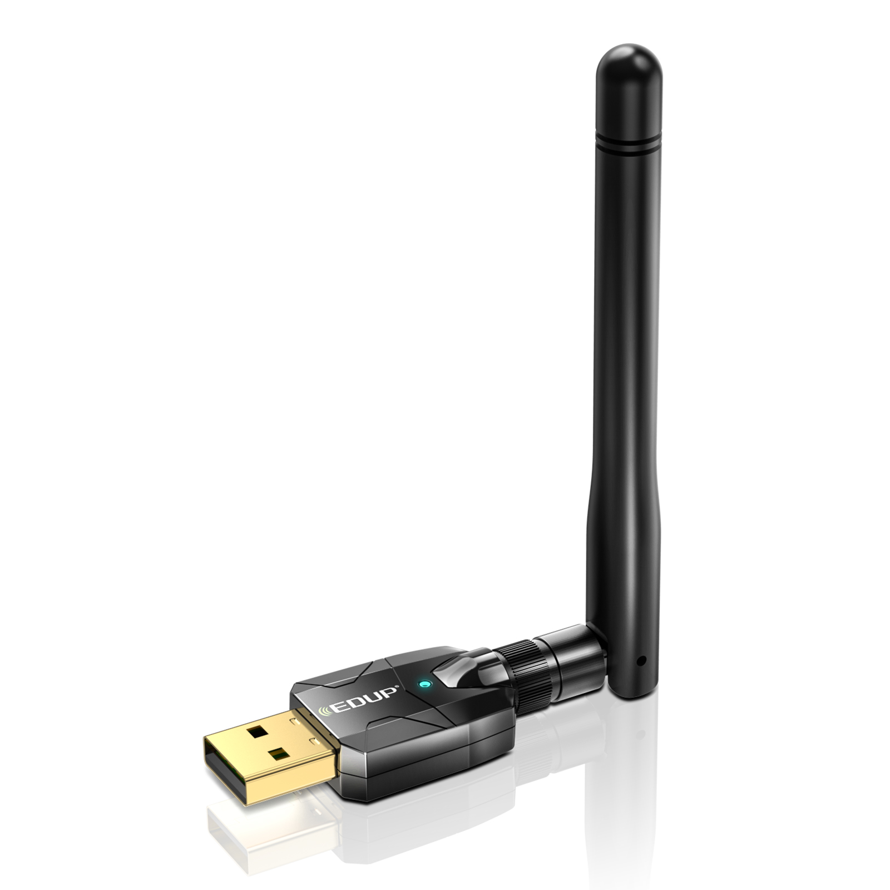
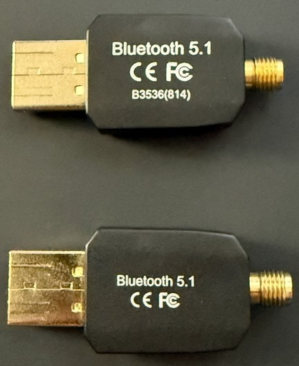
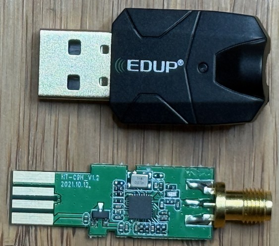
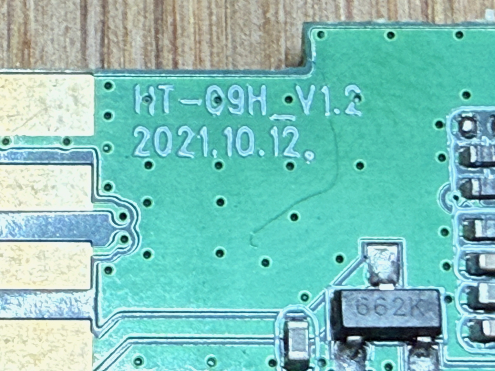
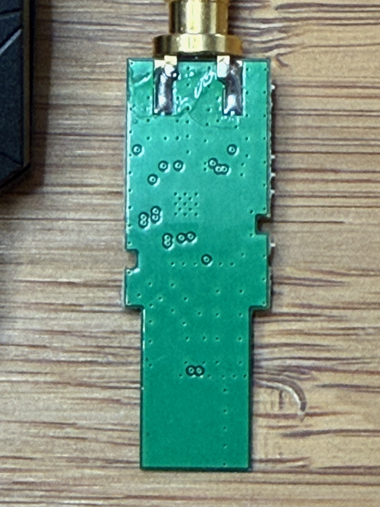

# EDUP EP-B3536 Dongle

This same dongle appears to be sold under the EDUP `EP-B3553Plus` model. Both have been tear down to find the same PCB and internals.

| Parameter        | Value                                            |
| ---------------- | ------------------------------------------------ |
| Chip             | [Realtek RTL8761BUV](Chip_Realtek_RTL8761BUV.md) |
| Transport        | USB                                              |
| VID&PID          | 0bda:a728, 2550:8761                             |
| External antenna | 1                                                |
| Connector        | SMA                                              |

## Vendor commands

Checkout the [Realtek RTL8761BUV](Chip_Realtek_RTL8761BUV.md) for information about vendor commands.

## Links and resources

- <https://szedup.com/bluetooth-adaptersdIK/EDUPB3536.html>
- <https://szedup.com/bluetooth-adaptersdIK/EPB3553Plus.html>
- <https://fcc.report/FCC-ID/2AHRDEP-B3536>
- <https://fcc.report/FCC-ID/2AHRDEP-B3536/5565788.pdf>
- <https://fcc.report/FCC-ID/2AHRDEP-B3536/5565787.pdf>

## Gallery

