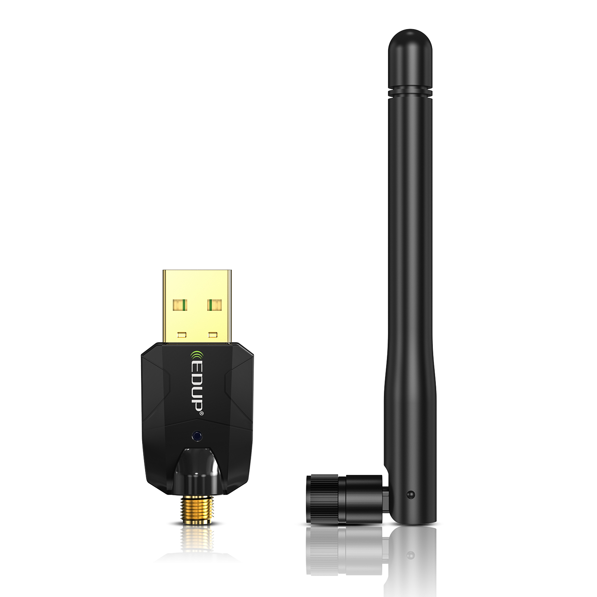

# EDUP EP-B3553Plus Dongle

| Parameter        | Value                                            |
| ---------------- | ------------------------------------------------ |
| Chip             | [Realtek RTL8761BUV](Chip_Realtek_RTL8761BUV.md) |
| Transport        | USB                                              |
| VID              | 0x0bda                                           |
| PID              | 0xa728                                           |
| External antenna | 1                                                |
| SMA              | Yes                                              |

## Vendor commands

Checkout the [Realtek RTL8761BUV](Chip_Realtek_RTL8761BUV.md) for information about vendor commands.

## Links and resources

- <https://szedup.com/bluetooth-adaptersdIK/EPB3553Plus.html>
