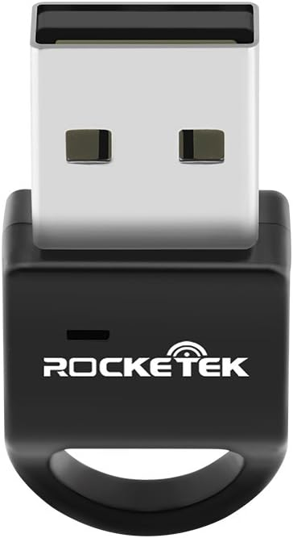

# Rocketek RT-BT4E Dongle

Another version of the similar looking dongle exist, [Rocketek RT-BT4](Rocketek_RT-BT4.md), based on [Broadcom BCM20702A](../Chip/Broadcom_BCM20702A.md).

| Parameter        | Value                                           |
| ---------------- | ----------------------------------------------- |
| Chip             | [Qualcomm CSR8150](../Chip/Qualcomm_CSR8150.md) |
| Transport        | USB                                             |
| VID&PID          | 0a12:0001                                       |
| External antenna | 0                                               |
| Connector        | No                                              |

## Vendor commands

Checkout the [Qualcomm CSR8150](../Chip/Qualcomm_CSR8150.md) for information about vendor commands.

## Links and resources

- <https://www.rocketek.hk/sdm_downloads/bluetooth-dongle-driver-for-rt-bt4e/>