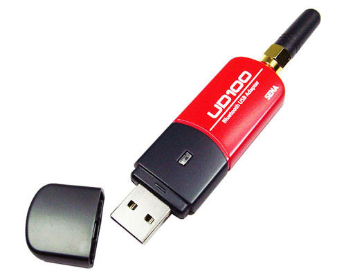
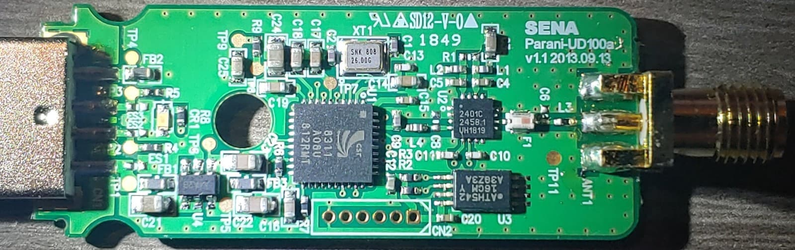

# Sena UD100 Dongle

| Parameter        | Value                                           |
| ---------------- | ----------------------------------------------- |
| Chip             | [Qualcomm CSR8311](../Chip/Qualcomm_CSR8311.md) |
| Transport        | USB                                             |
| VID&PID          | 0a12:0001                                       |
| External antenna | 1                                               |
| Connector        | RP-SMA                                          |

## Vendor commands

Checkout the [Qualcomm CSR8311](../Chip/Qualcomm_CSR8311.md) for information about vendor commands.

## Links and resources

- <https://www.senanetworks.eu/en/Bluetooth-USB-Adapter-BT-UD100/BT-UD100>
- <https://www.senanetworks.eu/media/c0/f7/bf/1682433149/BT-UD100_Manual.pdf>