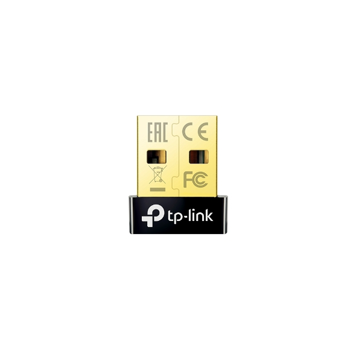

# TP-Link UB4A Dongle

| Parameter        | Value                                           |
| ---------------- | ----------------------------------------------- |
| Chip             | [Qualcomm CSR8150](../Chip/Qualcomm_CSR8150.md) |
| Transport        | USB                                             |
| VID&PID          | 0a12:0001                                       |
| External antenna | 0                                               |
| Connector        | No                                              |

## Vendor commands

Checkout the [Qualcomm CSR8150](../Chip/Qualcomm_CSR8150.md) for information about vendor commands.

## Links and resources

- <https://fcc.report/FCC-ID/TE7UB400>
- <https://fcc.report/FCC-ID/TE7UB400/4263573.pdf>
- <https://www.tp-link.com/es/home-networking/adapter/ub4a/>
- <https://www.tp-link.com/es/support/download/ub4a/>
