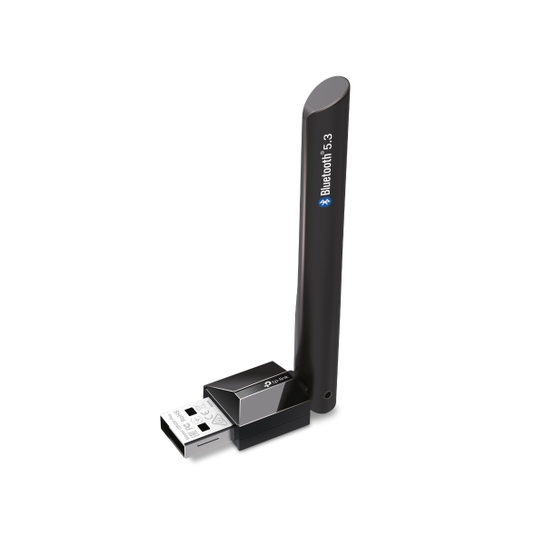

# TP-Link UB500 Plus Dongle

| Parameter        | Value                                            |
| ---------------- | ------------------------------------------------ |
| Chip             | [Realtek RTL8761BUV](Chip/Realtek_RTL8761BUV.md) |
| Transport        | USB                                              |
| VID&PID          | 2357:0604                                        |
| External antenna | 1                                                |
| Connector        | No                                               |

## Vendor commands

Checkout the [Realtek RTL8761BUV](Chip/Realtek_RTL8761BUV.md) for information about vendor commands.

## Links and resources

- <https://www.tp-link.com/us/home-networking/usb-adapter/ub500-plus/>
- <https://www.tp-link.com/us/support/download/ub500-plus/>
