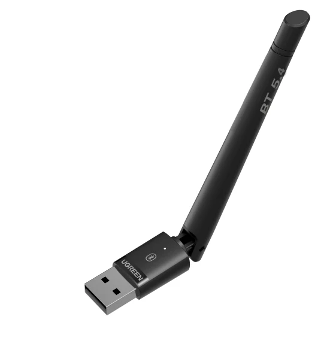

# UGREEN CM749 Dongle

| Parameter        | Value                                  |
| ---------------- | -------------------------------------- |
| Chip             | [Barrot BR8554](Chip_Barrot_BR8554.md) |
| Transport        | USB                                    |
| VID              | 0x33fa                                 |
| PID              | 0x0010                                 |
| External antenna | 1                                      |
| SMA              | No                                     |

## Vendor commands

Checkout the [Barrot BR8554](Chip_Barrot_BR8554.md) for information about vendor commands.

## Links and resources

- <https://fcc.report/FCC-ID/2AQI5-CM749>
- <https://fcc.report/FCC-ID/2AQI5-CM749/6884233.pdf>
