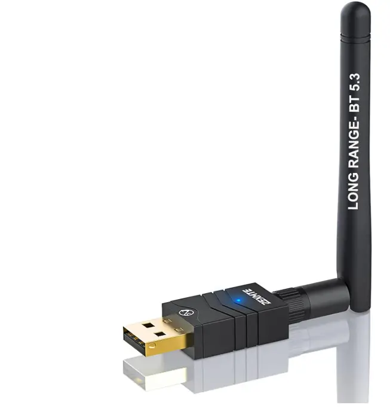

# ZEXMTE Unknown 1 Dongle

It is common to see this model advertised as 5.3 and 5.4 Bluetooth compatible but the chip only supports 5.1.

| Parameter        | Value                                            |
| ---------------- | ------------------------------------------------ |
| Chip             | [Realtek RTL8761BUV](Chip_Realtek_RTL8761BUV.md) |
| Transport        | USB                                              |
| VID              | 0x0bda                                           |
| PID              | 0xa728                                           |
| External antenna | 1                                                |
| Connector        | SMA                                              |

## Vendor commands

Checkout the [Realtek RTL8761BUV](Chip_Realtek_RTL8761BUV.md) for information about vendor commands.

## Links and resources

- <https://zexmtebluetooth.com/#Products>
